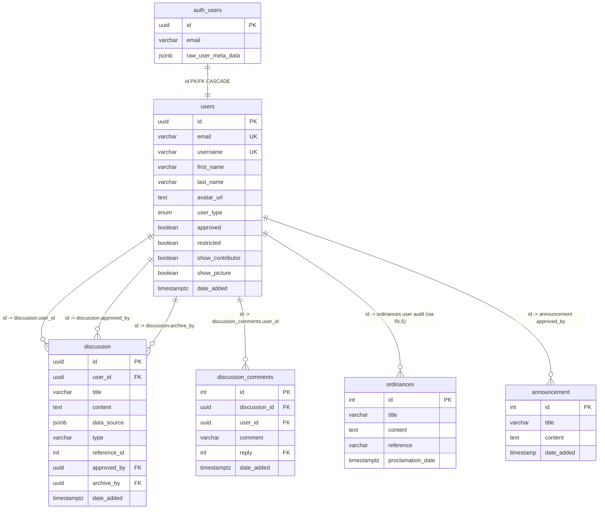

# BetterLucenaCity


**Transparent. Accessible. Para sa mamamayan.**

BetterLucenaCity is a community-driven platform that makes Lucena City's government information and public services more accessible, transparent, and easy to navigate.

Non-partisan. Facts-first. Built in the spirit of *bayanihan*.

## Table of Contents

- [Features](#features)
- [Tech Stack](#tech-stack)
- [Design Philosophy](#design-philosophy)
- [Database Schema](#database-schema)
- [Supabase Configuration](#supabase-configuration)
- [File Structure](#file-structure)
- [Getting Started](#getting-started)
- [Data Sources](#data-sources)
- [Contributing](#contributing)
- [License](#license)

## Features

- **Services directory** — LGU services with requirements, fees, and office locations
- **Transparency dashboard** — budget and project data surfaced from public sources
- **Ordinances & legal documents** — searchable local legislation
- **Announcements** — city advisories and bulletins
- **Live civic data** — server-proxied feeds for weather (Open-Meteo), earthquakes (Phivolcs), and DPWH infrastructure projects
- **Interactive map** — Leaflet map of Lucena City with boundary data
- **Contributor portal** — authenticated community member profiles with role-based access
- **User management & moderation** — Head Maintainer and Maintainer dashboards with search (username/email), verified restrict/unrestrict flows, and admin-only role changes

## Tech Stack

- [Next.js](https://nextjs.org) 16+ (App Router) · React 19 · TypeScript
- Tailwind CSS v4 with a minimalist Material Design 3-inspired design system
- Leaflet / react-leaflet for mapping
- Supabase (Postgres + Auth) for contributor profiles
- Server Components by default; live data fetched server-side with `revalidate` caching

## Design Philosophy

BetterLucenaCity is built around a few civic-minded principles:

- **Minimalist Material Design 3 (Material You).** Clean surfaces, ample whitespace, restrained color, and purposeful motion. A deep teal/forest green primary with warm amber secondary reflects Lucena City's identity, paired with neutral surfaces and subtle elevation (1dp / 3dp / 6dp) for cards, navigation, and dialogs.
- **Accessible by default.** Clear typographic hierarchy (Roboto/Inter), high contrast, and keyboard-friendly components so the platform works for every citizen.
- **Server-first, light on the client.** Server Components do the heavy lifting; only interactive pieces (maps, live feeds, theme toggle, forms) are Client Components. This keeps pages fast and resilient.
- **Facts-first, never invented data.** Government details, hotlines, and records are verified before publishing. Where verified values are unavailable, placeholders are clearly marked rather than guessed.
- **Bayanihan over partisanship.** The project is non-partisan and community-driven, designed to invite contribution while maintaining data accuracy and accountability.

## Database Schema

The application uses Supabase (PostgreSQL) to store contributor profiles. The schema is defined via SQL migrations in `supabase/migrations/`.

### `users` table

| Column | Type | Constraints / Notes |
|--------|------|---------------------|
| `id` | `uuid` | Primary key, FK → `auth.users(id)` ON DELETE CASCADE |
| `email` | `varchar` | Unique, NOT NULL |
| `first_name` | `varchar` | — |
| `last_name` | `varchar` | — |
| `username` | `varchar` | Unique, NOT NULL |
| `avatar_url` | `text` | — |
| `user_type` | `user_type` (enum) | Nullable until role requested |
| `approved` | `boolean` | Default `false` — pending until Maintainer/Head Maintainer approves |
| `restricted` | `boolean` | Default `false` — when `true`, `CheckPermission()` denies all permissions |
| `show_contributor` | `boolean` | Default `false` — opt-in to public `/contributors` listing |
| `show_picture` | `boolean` | Default `false` — opt-in to show avatar publicly |
| `date_added` | `timestamptz` | Default `now()` |

### `user_type` enum

```
'Head Maintainer' | 'Maintainer' | 'Data Collaborator' | 'Data Validator' | 'Tester'
```

### Entity Relationship (Mermaid)



### Security & Governance (RLS, Triggers, Permissions)

- **Row Level Security (RLS)** enabled on `users`.
  - `Users can read all profiles` — `FOR SELECT USING (true)` (any user can read directory; public credit respects `show_contributor`/`show_picture`).
  - `Users can update own profile` — `USING (auth.uid() = id) WITH CHECK (auth.uid() = id)`.
  - `Maintainers can update any profile` — `USING (is_maintainer()) WITH CHECK (is_maintainer())`, where `is_maintainer()` checks `user_type IN ('Head Maintainer','Maintainer') AND approved = true`.

- **Triggers**
  - `enforce_approved_before_update` (`enforce_approved()`) — blocks self-approval (`approved false → true` only if `is_maintainer()`) and self-elevation to `Maintainer`/`Head Maintainer`.
  - `enforce_restricted_before_update` (`enforce_restricted()`) — restricts: `false→true` requires `is_maintainer()` and blocks restricting a `Head Maintainer` unless caller is Head Maintainer; unrestrict `true→false` requires `is_head_maintainer()`; also blocks non-head assigning or changing `Head Maintainer` role.

- **Application-level permission** (`src/lib/roles.ts:CheckPermission`): denies if `restricted = true` or `approved != true`, then maps `user_type` to permissions:

  | user_type | permissions |
  |-----------|-------------|
  | Head Maintainer | `ALL` |
  | Maintainer | `maintainer`, `contribute`, `discussion`, `report` |
  | Data Collaborator | `contribute`, `discussion`, `report` |
  | Data Validator | `discussion`, `report`, `validate` |
  | Tester | `contribute`, `discussion`, `report`, `validate` |

### User Management Policy (Admin vs Maintainer)

| Capability | Head Maintainer (`/admin`) | Maintainer (`/maintainer`) |
|------------|----------------------------|----------------------------|
| View pending | ✅ via `/api/admin/pending` + `/admin` | ✅ via same |
| Search users (email/username) | ✅ `GET /api/admin/users?q=` | ✅ `GET /api/maintainer/users?q=` (Head Maintainers hidden) |
| Restrict user | ✅ `POST /api/admin/restrict` with confirm modal | ✅ `POST /api/maintainer/restrict` (only `restricted:true`) with confirm modal |
| Unrestrict user | ✅ `POST /api/admin/restrict` (`restricted:false`) | ❌ blocked — 403, message “Contact a Head Maintainer” |
| Change role (Tester→Maintainer etc.) | ✅ `POST /api/admin/change-role` — allowed `Maintainer`, `Data Collaborator`, `Data Validator`, `Tester` (Head Maintainer protected) with UI dropdown | ❌ no UI |
| Restrict Head Maintainer | ✅ allowed (with caution) | ❌ blocked by API + DB trigger |
| Self-restrict / self-role-change | ❌ blocked | ❌ blocked |
| Verification | Modal with target card + amber warning + Cancel/Confirm, re-checked server-side + DB trigger | Same |

### Navigation Structure

```
/admin           → Pending contributors (approve)
/admin/users     → User management (search, restrict/unrestrict, change role)
/maintainer      → Pending contributors (approve)
/maintainer/users→ User management (search, restrict-only, Head Maintainers hidden)
```

`src/components/admin/dashboard-nav.tsx` provides pill tabs (`Pending` / `Users`) with active `bg-primary` state, used in both `src/app/(admin)/admin/layout.tsx` and `src/app/(maintainer)/maintainer/layout.tsx`.

## Supabase Configuration

The app uses [Supabase](https://supabase.com) for its PostgreSQL database and authentication (contributor profiles). Two sets of credentials are needed: server-side (secret) and public (browser-safe) keys.

### Environment Variables

Create a `.env` file in the project root with the following variables (do **not** commit it — it is gitignored):

```env
# Server-side (secret) — used by server components and route handlers
NEXT_SUPABASE_PROJECT_URL=
NEXT_SUPABASE_PASSWORD=
NEXT_SUPABASE_PUBLISHABLE_KEY=

# Public (browser-safe) — exposed to the client, prefixed with NEXT_PUBLIC_
NEXT_PUBLIC_SUPABASE_URL=
NEXT_PUBLIC_SUPABASE_ANON_KEY=
```

| Variable | Scope | Purpose |
|----------|-------|---------|
| `NEXT_SUPABASE_PROJECT_URL` | Server | Supabase project URL for server-side client |
| `NEXT_SUPABASE_PASSWORD` | Server | Database / service role password for server-side access |
| `NEXT_SUPABASE_PUBLISHABLE_KEY` | Server | Supabase publishable key for server-side client |
| `NEXT_PUBLIC_SUPABASE_URL` | Public | Supabase project URL exposed to the browser |
| `NEXT_PUBLIC_SUPABASE_ANON_KEY` | Public | Supabase anon key exposed to the browser (safe by RLS) |

> **Note:** The `NEXT_PUBLIC_*` values are embedded in the client bundle and must remain safe to expose. Keep all data protected with Row Level Security (RLS) — see [Database Schema](#database-schema).

Apply the SQL migrations in `supabase/migrations/` to set up the `users` table and RLS policies before running the app.

## File Structure

```
src/
  app/                      # Next.js App Router pages and API routes
    api/                    # Route handlers
      admin/
        pending/            # GET pending users (approved=false)
        approve/            # POST approve user
        users/              # GET search users (admin, Head only)
        restrict/           # POST restrict/unrestrict (Head only, with verification)
        change-role/        # POST change user_type (Head only, no Head assignment)
      maintainer/
        users/              # GET search users (Maintainer+, hides Head Maintainers)
        restrict/           # POST restrict-only (Maintainer)
      budget/national/ local/ | dpwh/projects/ | earthquakes/ | geography/boundary/ | legal/documents/ | weather/ | announcements/ | discussion/
    auth/callback/          # Supabase auth callback
    (admin)/admin/          # Head Maintainer dashboard
      layout.tsx            # CheckPermission(admin) + DashboardNav
      page.tsx              # Pending
      users/page.tsx        # UserManagement variant=admin
    (maintainer)/maintainer/# Maintainer dashboard
      layout.tsx            # CheckPermission(maintainer) + DashboardNav
      page.tsx              # Pending
      users/page.tsx        # UserManagement variant=maintainer
    (contribute)/contribute/# Contributor flow (role select → pending → contribute)
    (discussion)/discussion/# Private 3-way threads
    announcements/ | contact/ | contributors/ | legal/ | services/ | transparency/ | barangays/ | report/
    layout.tsx | page.tsx | globals.css | middleware.ts
  components/
    admin/
      pending-list.tsx     # Approve queue
      user-management.tsx  # Search + restrict/unrestrict + role change + confirm Modal
      dashboard-nav.tsx    # Pill tabs for /admin & /maintainer (Pending ↔ Users)
    layout/                # Header, footer, hotlines, page headers, profile-menu
    live/                  # Live civic data client components
    map/                   # Leaflet map components
    sections/              # Home page sections
    theme/                 # Theme provider + toggle
    transparency/          # National budget section
    ui/                    # Card, Button, Modal
  lib/
    data/                  # Local site content and sample data
    sources/               # Server-side clients for external APIs
    supabase/              # client/server, get-user-id
    roles.ts               # roles map, CheckPermission (respects restricted/approved)
    role-options.ts        # SELF_SELECT_ROLES
    cache.ts | functions.ts
  types/                   # TypeScript declarations
public/  # logos, seals, PWA assets
supabase/
  migrations/              # SQL schema + RLS + triggers (enforce_approved, enforce_restricted)
  config.toml
```

## Getting Started

```bash
git clone https://github.com/<your-username>/BetterLucenaCity.git
cd BetterLucenaCity
npm install
npm run dev
```

Open [http://localhost:3000](http://localhost:3000) in your browser.

### Other Scripts

```bash
npm run build   # production build
npm run start   # serve the production build
npm run lint    # eslint
npm run gh-test # eslint + next build (run before pushing)
```

## Data Sources

External data is proxied through our own route handlers with attribution included:

| Feed | Source |
|------|--------|
| Weather | Open-Meteo |
| Earthquakes | earthquakeapi.forestparty223 |
| Infrastructure projects | DPWH Infrastructure Transparency Portal |

Official service details, hotline numbers, and records are verified before publishing. Placeholders are clearly marked when verified values are unavailable — never invent government data.

## Contributing

Salamat sa pag-contribute! See [CONTRIBUTING.md](CONTRIBUTING.md) for how to get started, our code style rules, and data accuracy guidelines.

> **Beyond code:** This project lives on trustworthy public information. You can contribute by **gathering, verifying, validating, and sharing** data — no coding needed. Anyone is welcome to submit a report via [`/contribute`](/contribute) **as long as it is valid, from a reliable source, and includes supporting documents** (link, PDF, photo, or reference no.) whenever possible.

- **Data & transparency reports** — submit via the private in-app `/contribute` form (sign-in required) — **do not use GitHub Issues** for data. See [CONTRIBUTING.md — Contributing Data & Reports](CONTRIBUTING.md#contributing-data--reports-no-code-needed).
- **Corrections & large datasets → private 3-way discussion on the website (not GitHub)** — these submissions open a private thread between the **Source** (you), the **Data Validator**, and the **Head Maintainer** (admin) where questions, supporting documents, and the final decision stay contained. Kept off GitHub Issues to protect contributor privacy and mental health.
- **Want to do more? Register for a role** — after signing in you may request to become a **Data Collaborator** (regular data gatherer) or **Data Validator** (reviews submissions before publication). **Both roles are strictly non-partisan** — collaborators and validators must gather/approve all verifiable public-interest data equally, no cherry-picking to favor or oppose any political party; validators additionally require research knowledge to prevent false information. See [CONTRIBUTING.md — Data Validator requirements](CONTRIBUTING.md#create-an-account--data-gathering--validator-roles).
- **Privacy — username & email:** contributors are shown publicly by **username only** on [`/contributors`](../../contributors) (opt-in/out to give credit). Email is never displayed and is used **only for system notifications via the Head Maintainer’s account** — validators never email you directly.
- Report **code bugs** via [Issues](../../issues) — for **data inaccuracies**, use the private [`/contribute`](../../contribute) form (with sources + supporting documents) so the discussion stays between you, the Validator, and the Head Maintainer for privacy
- Harassed by another contributor? See [Code of Conduct](CODE_OF_CONDUCT.md) and report privately via [`/report`](../../report) with screenshot/proof — we follow **RA 11313 (Anti-Bastos Law)**, investigate without bias before judging, and sanctions range to ban/disqualification (records may be used as legal evidence with consent)
- Please review our [Code of Conduct](CODE_OF_CONDUCT.md)
- Security vulnerabilities: see [SECURITY.md](SECURITY.md) — do not open public issues for them
- Discussion Board: To welcome all contributors, please read this [Discussion](https://github.com/RyannKim327/BetterLucenaCity/discussions/19) for more details.

## License

Distributed under the [MIT License](LICENSE.md).
