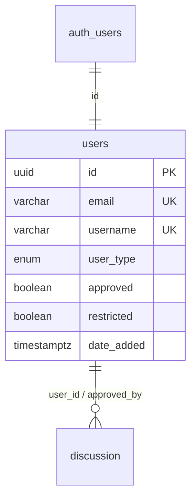

# Security Policy

## Supported Versions

This project is in early development. Only the latest version on `main` receives security fixes.

| Version | Supported |
|---------|-----------|
| latest `main` (0.1.x) | Yes |
| < 0.1 | No |

## Reporting a Vulnerability

We take security seriously at Better Lucena City. Salamat for helping keep this civic portal safe.
If you discover a security vulnerability, please report it responsibly.

### How to Report

**Do NOT open a public GitHub issue for security vulnerabilities.**

Instead, please email: **weryses19@gmail.com** or message thru https://linkedin.com/in/ryannkim327

Include in your report:

- Description of the vulnerability
- Steps to reproduce or a proof of concept
- Affected files, routes, or dependencies
- Potential impact
- Suggested fix (if any)

Include the word **"SECURITY"** in the subject line so it is routed quickly.

### Response Timeline

| Action | Timeframe |
|--------|-----------|
| Acknowledgment | Within 72 hours |
| Initial Assessment | Within 7 days |
| Resolution Target | Within 30 days |
| Public Disclosure | After fix is deployed |

We will keep you informed of progress toward a fix and may ask follow-up questions during triage.

## Security Measures

### Current Implementations

**Server Security:**
- Server-side proxying of all upstream government/API requests (no direct browser-to-API exposure for data sources)
- Upstream fetches cached via `next: { revalidate }` to avoid hammering public government endpoints
- Secrets managed through environment variables (`.env.local`, never committed)
- Supabase Auth via `@supabase/ssr` with `middleware.ts` session refresh; `auth.users` → `public.users` FK CASCADE

**Application Security & Moderation:**
- TypeScript strict typing across app routes and API handlers (`app/api`)
- React Server Components by default; minimal client-side JavaScript surface
- External API responses treated as untrusted input before rendering
- **Role-based access control** via `src/lib/roles.ts:CheckPermission()` — denies if `restricted=true` or `approved≠true`, then checks `roles` map (Head Maintainer = `ALL`).
- **Restrict/Unrestrict verification:** `src/components/admin/user-management.tsx` requires amber `Modal` confirmation (target card, consequence text, Cancel/Confirm) before `POST /api/admin/restrict` or `POST /api/maintainer/restrict`. Server re-checks permission + self-check; DB trigger `enforce_restricted` is the final guard.

**Database Security (Supabase Postgres + RLS + Triggers):**

- **RLS on `users`:** `Users can read all profiles` (`SELECT true`); `Users can update own profile` (`auth.uid()=id`); `Maintainers can update any profile` (`is_maintainer()`).
- **Helpers:** `is_maintainer()` (Head/Maintainer + approved), `is_head_maintainer()` (Head + approved).
- **Triggers:**
  - `enforce_approved` — blocks self-approval and self-elevation to Maintainer/Head.
  - `enforce_restricted` — `restrict (false→true)` requires `is_maintainer()` and blocks restricting Head unless caller is Head; `unrestrict (true→false)` requires `is_head_maintainer()`; blocks non-head assigning/changing `Head Maintainer` role (error `42501`).
- **API policies:**

  | Endpoint | Who | What | Guard |
  |----------|-----|------|-------|
  | `GET /api/admin/users?q=` | Head only | List all, ILIKE username/email | `CheckPermission(admin)` |
  | `GET /api/maintainer/users?q=` | Maintainer+ | List without Head Maintainers | `CheckPermission(maintainer)` + filter |
  | `POST /api/admin/restrict` | Head only | `restricted` true/false | Self-block + DB trigger |
  | `POST /api/maintainer/restrict` | Maintainer+ | `restricted:true` only | Block `false` 403 + cannot restrict Head |
  | `POST /api/admin/change-role` | Head only | `Maintainer/Data Collaborator/Data Validator/Tester` | No Head assignment, no self-change, Head protected |

**Data Security:**
- All data sourced from public government portals and open-data feeds
- PII limited to `users` table (email, username, avatar); public credit respects `show_contributor`/`show_picture` opt-in; email never displayed
- Sample/placeholder data clearly separated from live sources under `lib/sources`

### Third-Party Services

| Service | Purpose | Data Shared |
|---------|---------|-------------|
| Open-Meteo | Weather forecasts | Coordinates (Lucena City) |
| Phivolcs Scrape API | Earthquake advisories | None |
| Nominatim / OpenStreetMap | Boundary and map data | Query parameters (Lucena City) |
| DPWH Transparency API | Infrastructure projects | None |

## Best Practices for Contributors

When contributing code:

1. **Never commit secrets** — API keys, passwords, or credentials belong in `.env.local`
2. **Validate inputs** — Sanitize any user-facing inputs and treat upstream API responses as untrusted; verify `q` sanitization in `GET /api/*/users` and `restricted` boolean checks
3. **Preserve moderation guards** — Do not bypass `Modal` confirmation, `CheckPermission`, or `enforce_restricted`/`enforce_approved` triggers; test `restricted` and role-change paths as Head vs Maintainer
4. **Keep caching enabled** — Preserve `next: { revalidate }` on upstream fetches
5. **Review dependencies** — Run `npm audit` before upgrading and address known advisories
6. **Report data inaccuracies through `/contribute`** — They are quality concerns, not security ones; use `/report` for harassment (RA 11313)
7. **Test moderation as both roles** — Verify Maintainer cannot see Head Maintainers, cannot unrestrict, and cannot change roles; verify Admin can do both with Modal

## Scope

This security policy covers:

- The Next.js application in this repository (pages, API route handlers under `app/api`, server-side clients under `lib/sources`)
- Dependency vulnerabilities affecting the deployed application
- Misconfiguration that would leak data or allow unauthorized access
- Associated build tools and scripts

Out of scope:

- Vulnerabilities in third-party government APIs we proxy (please report those to the respective LGU/national agency)
- Social engineering, physical attacks, or denial-of-service via volume
- Issues in sample/placeholder data
- User's local environment

## Contact

For security concerns: **weryses19@gmail.com** or message thru https://linkedin.com/in/ryannkim327

For general inquiries: Open a GitHub issue in this repository.

---

Thank you for helping keep Lucena City's civic data secure for everyone.
